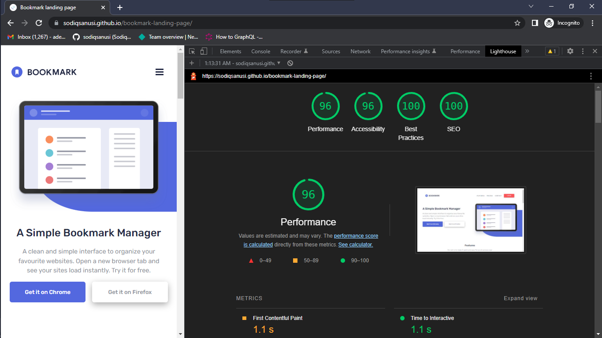

# Bookmark Landing Page

## Table of contents

- [Overview](#overview)
  - [The challenge](#the-challenge)
  - [Screenshot](#screenshot)
  - [Links](#links)
- [My process](#my-process)
  - [Built with](#built-with)
  - [What I learned](#what-i-learned)
  - [Continued development](#continued-development)
  - [Useful resources](#useful-resources)
- [Author](#author)
- [Acknowledgments](#acknowledgments)

## Overview
The goal was to build the landing page of a web extension. The landing page should have a responsive, fully functional interface consisting of a FAQ accordion section, a email input from the user that's validated client-side among other functionalities.

### The challenge
Users should be able to:

- View the optimal layout for the site depending on their device's screen size
- See hover states for all interactive elements on the page
- Receive an error message when the newsletter form is submitted if:
  - The input field is empty
  - The email address is not formatted correctly

### Screenshot

### Links
- Solution URL: [https://github.com/sodiqsanusi/bookmark-landing-page/](https://github.com/sodiqsanusi/bookmark-landing-page/)
- Live Site URL: [https://sodiqsanusi.github.io/bookmark-landing-page/](https://sodiqsanusi.github.io/bookmark-landing-page/)

## My process
Okay. To be very honest, I fucked this up. This was something I estimated two(2) days for, yet spent five days (almost a week fam) working on. Uhmm, started out with drawing up the HTML structure on paper before replicating it in code. Then moved on to styling (mobile-first), this took majority of the time spent as I was new to some designs which I had to implement in the landing page. After the styling for small screen devices, I worked on making things work, the functionalities. Used media queries to get an optimal interface for large screen devices, tested the site using Lighthouse ,then worked on the feedback gotten for optimizations. Pretty much the old routine. 

### Built with
- Mobile-first workflow.
- Flexbox.

### What I learned
Actually got an insight on how to build an accordion FAQ section building this, played around with making custom backgrounds with SVGs and `::after` pseudoelements, also used Josh Comeau CSS Reset which was new sha. Maybe I didn't really learn much on this project? Can't conclude on that by myself fr.

### Continued development
Need to work on something more challenging than anything I've done really. If I see an internship opportunity, then I'll probably go for it. If I don't, then a FrontendMentor Pro subscription is something I'll start saving up for.

> Still haven't made my portfolio🤕

### Useful resources
- [RegExr](https://regexr.com/) - This is an interface where you can write regex and see its effects realtime, twas very useful in writing regex for the email validation (which I didn't get). You can also get popular regex patterns from there too, so you don't reinvent the wheel.
## Author
- Twitter - [@sodiqsanusi0](https://www.twitter.com/sodiqsanusi0)
- LinkedIn - [Sodiq Sanusi](https://www.linkedin.com/in/sodiqsanusi0)

## Acknowledgments
Today's acknowledgements actually goes to you. For going through this chaotic README description, you absolutely deserve it, thanks.
